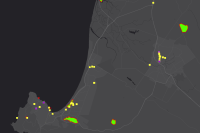

# Overview

The Get Started page includes all of the tasks that are required to set up the application, getting you from downloading the application to the processes detailed in the Workflows section. This will include:

*   Publishing Feature Services
*   Configuring Geoevent Extension for ArcGIS Server
*   Publishing Web Map and Dashboard
*   Testing the Installation

Before you start publishing services, download the template and unzip it to your local machine. The folder you unzip the template into is refered to a TemplateInstall in all the setup steps.

# Publish services

The Movement Analysis service contains all the layers for analysis and visualization layer. Select a deployment method (ArcGIS for Server or ArcGIS Online hosted service) and follow the steps below to publish the required service for the Damage Collector map.

## Movement Analysis Service

Use the MovementAnalysis.mxd found in TemplateInstall/Maps to publish the Movement Analysis map service. Complete the following steps:

*   **Title:**MovementAnalysis
*   **Thumbnail image:** 
*   **Summary:** The movement analysis service presents a real time picture about movement of individuals or groups.
*   **Description:** The movement analysis service is used to depict derived information about the movement of individuals or group. The information in this service is the result of real-time analysis of patterns of movement. This information can be used to visualize and understand the patterns of activity or be used to alert for activity around monitored locations. This service includes several key layers which are used to normalize complex movement data and prepare it for visualization or analysis. This include:
    *   Stay Locations – Point and Polygon layers which represent any location where a monitored individual spends any amount of time.
    *   Pattern Locations – Areas created based on frequently used stay locations. These can be derived from statistical methods or just observed activity.
    *   Suspicious Locations – Areas which have been defined based on the knowledge of the individual or group and include areas where they are likely to frequent. Examples of suspicious locations include:
    *   Meeting Locations
    *   Suspect Home and Workflow Locations
    *   Public Venues that a suspect is known to frequent
*   **Tags:** MovementAnalysis, FeatureServer, Movement, Patterns, POL, Lifestyle, Stay Location, Crossing Point, Transits, Suspicious, Meeting, Suspect, Monitoring
*   **Editing properties:** Enable editing and allows editors to add, update, and delete features.
*   
# Configure GeoEvent Services

The Movement Analysis Template includes a number of predefined services for use with the GeoEvent Extension for ArcGIS Server. Follow these steps to get these services deployed and operational on your Server. You will need Admin access to your GeoEvent Server in order to perform these steps

I.  Deploy Custom Components
         ##### Note:
         
         If you have already deployed the GeoEvent Extension custom Component for ArcGIS Solutions you can skip this step. Detailed instructions are available for [Deploying Custom Component to GeoEvent](https://solutions.arcgis.com/defense/templates/geoevent-extension/get-started/install-components/)

   1.  Deploy Twitter Transport. Located in TemplateInstall\GeoEventExtension\Components\Transports
   2.  Deploy Twitter Adaptor. TemplateInstall\GeoEventExtension\Components\Adaptors
   3.  Deploy Local Processors. Located in TemplateInstall\GeoEventExtension\Components
   
      *   Track Idle
      *   Cache Aware Field Calculator
      *   Polygon to Point

II.  Import Configuration Store

   1.  Navigate to the **Configuration Store** settings. Located under Site > GeoEvent in GeoEvent Manager.
   2.  Choose **Import Configuration** and browse to the **GeoEventConfig_Movement.xml** file in TemplateInstall\GeoEventExtension\Configuration folder. Import the entire configuration
   
         ##### Note:
         
         
         You may have errors after the import related to the Twitter Definition. You can ignore this error.
   
   3.  After the Import Completes navigate to the **Data Stores** Tab. Located under Site > GeoEvent in GeoEvent Manager.
   4.  Edit the OpsServer Data Stores property to point your ArcGIS for Server instance where you published the Movement Feature Services. Repair the default data store to point to your default portal
   
   5.  Publish Stay Location Stream Service

      A.  Edit the Movement-NewStayLocations Output. Located under Services > Outputs in GeoEvent Manager
      B.  Choose Publish Stream Service
      
         *   Name: Movement-NewStayLocations
         *   Geometry Type: Polygon
         *   Display Field Name: locationname
         *   Store Latest: Checked
         *   Override: Unchecked
         *   Store Latest: Unchecked
         
         
   
      
      C.  Save Output
      
   6.  Publish GPS Stream Service
      
      A.  Edit the Movement-GPSStream Output. Located under Services > Outputs in GeoEvent Manager
      B.  Choose **Publish Stream Service**
      
         *   Name: Movement-GPSStream
         *   Geometry Type: Point
         *   Display Field Name: individualid
         *   Store Latest: Checked
         *   Override: Unchecked
         *   Store Latest: Unchecked
         
      C.  Save Output

   7. If you are using the Twitter Input, Set the Twitter Input to your developer API key and conumer key. 
   
   8.  Validate Installation
   
      A.  Validate Inputs
      B.  Validate Ouputs
      C.  Validate Services

